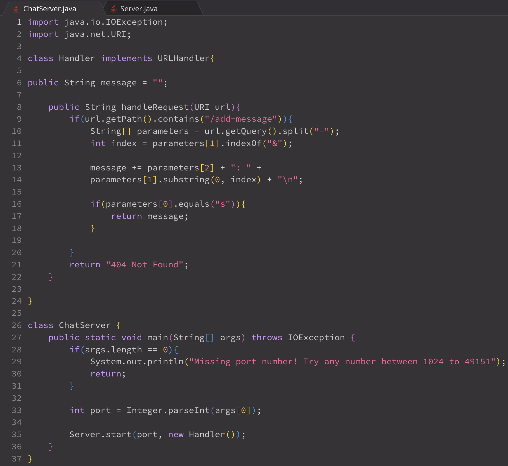
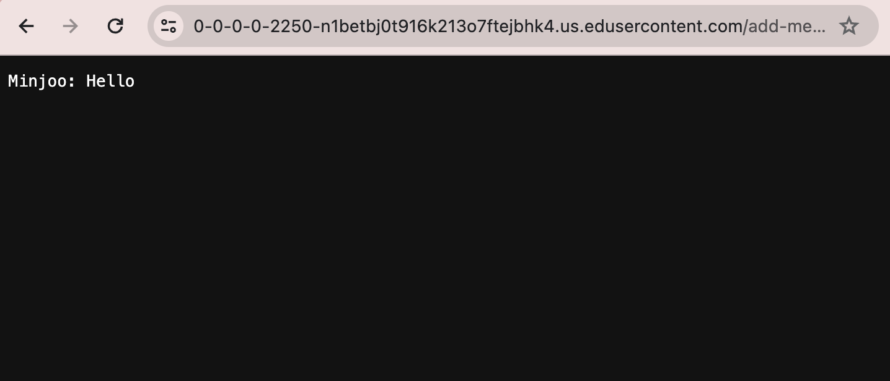
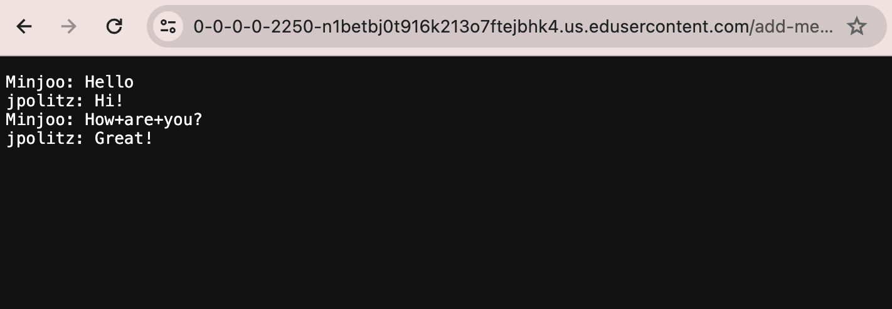
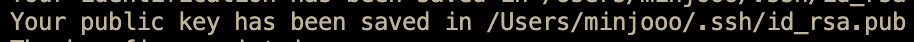
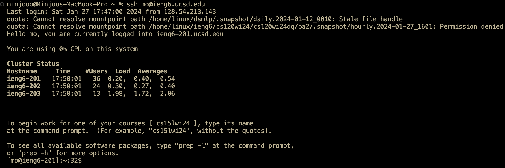

# Minjoo O: CSE15L Lab Report 2
---
## Part 1:
**Code for `ChatServer`:** \

**Using `/add-message` for the first time:** \

* First, the after the code is compiled, I provide an argument (port number) to the `main` method, which in turn provides a call to the Server.`start` method, starting the server. Then, the methods called in my code are: `handleRequest`, which then provides calls to `getPath`, `contains`, `getQuery`, `split`, `indexOf`, `substring`, and `equals`
* The `main` method takes in `args` to store its arguments and uses the first argument as a port number to start the server using the `start` method. `url.getPath().contains("/add-message")` contains the argument `"/add-message"` in order to make sure that the user includes the correct request. Then, `url.getQuery().split("=")` contains the argumnet `"="` to separate the contains of the query with instances of `=`. In order to obtain the message of the user, I use the `substring` method with the argument of `0` to the `indexOf("&")`. The field `message` is instantiated with the value `""`.
* From this request, the value of `message` changes from `""` to the a value of `[user]: [user's message]` for the first time. 
  
**Using `/add-message` again:** \

* The methods that are called now are: `handleRequest`, which then again provides calls to `getPath`, `contains`, `getQuery`, `split`, `indexOf`, `substring`, and `equals`
* `url.getPath().contains("/add-message")` contains the argument `"/add-message"` in order to make sure that the user includes the correct request. Then, `url.getQuery().split("=")` contains the argumnet `"="` to separate the contains of the query with instances of `=`. In order to obtain the message of the user, I use the `substring` method with the argument of `0` to the `indexOf("&")`. The field `message` contains the value of the previous message value (`[user]: [user's message]`)
* From this request, the value of `message` changes from the previous `[user]: [user's message]` to `[user]: [user's message]`\
`[user]: [user's message]`

## Part 2:
**Absolute path to private key:**

**Absolute path to public key:**

**Logging into account without password:**

## Part 3:
In weeks 2 and 3, I learned how to build and run a web server basically from scratch by implementing methods within the `Server` class and `ChatServer` class, using a port number to specify where the server runs on, and adding different paths and queries onto the URL to see changes. Additionally, I learned how to also log into my ieng6 account on a remote computer to run the server.

