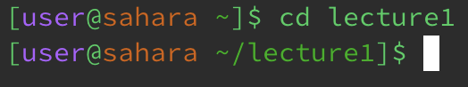
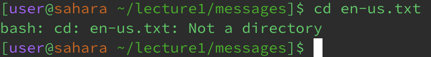
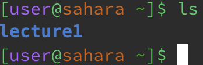
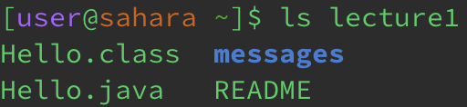
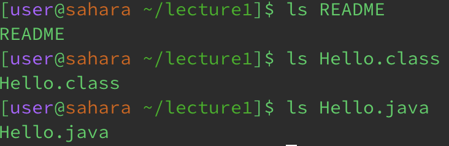
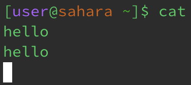
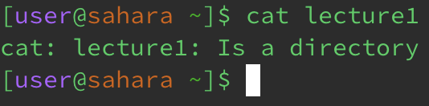
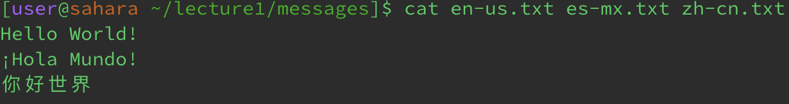

# Minjoo O: CSE15L Lab Report 1
---
## Using command: `cd`

**Using the command with no arguments:** \
 
* The working directory was: `/home/lecture1`
* Using the command `cd` with no following argument returns the user's location from the current directory to the `home` directory because when there is no argument or directory to switch the terminal into, the terminal goes to its default directory, which is the `home`.
* This output is not an error. Using the command `cd` without an argument should take the user to the `home` directory.
  
**Using the command with a path to a directory as an argument:** \
 
* The working directory was: `/home`
* The command `cd` with a path to a directory as an argument allows the user to switch directories. So, because the working directory was `/home`, and the argument or path provided (`lecture1`) is a directory within the `home` directory, the output is that we are now in the `lecture1` directory (`/home/lecture1`)
* This output is not an error. Using the command `cd` with a valid argument (path to directory) should take the user to the specified directory.
  
**Using the command with a path to a file as an argument:** \

* The working directory was: `/home/lecture1/messages`
* This output is due to the fact that the `cd` command cannot accept a file or anything that is not a directory as an argument. The `cd` command is used to switch from one directory to another directory, not to access files.
* This output is an error. The `cd` command cannot execute because the argument provided is not a path to a directory.
  
---

## Using command: `ls`

**Using the command with no arguments:** \
 
* The working directory was: `/home`
* Using the command `ls` with no following argument lists the files and directories of the directory that we are currently in. Since we are in the `home` directory, we see `lecture1` listed.
* This output is not an error. Using the command `ls` without an argument should list the files and directories of the directory we are in.
  
**Using the command with a path to a directory as an argument:** \
 
* The working directory was: `/home`
* Even though we are in the `home` directory, because we used the `ls` command with `lecture1` as the argument, the files and directories contained within `lecture1` are listed. 
* This output is not an error. Using the command `ls` with a directory as an argument should list that directory's files and directories.
  
**Using the command with a path to a file as an argument:** \

* The working directory was: `/home/lecture1`
* Since we are in the `lecture1` directory, we can access its files. When we use `ls` with a file name as an argument, it simply repeats the file name because files are not folders and therefore cannot contain more files or directories
* This output is not an error. Using the command `ls` with a file as an argument just repeat its file name.

---

## Using command: `cat`

**Using the command with no arguments:** \
 
* The working directory was: `/home`
* Using the command `cat` with no following argument simply repeats the input of the user as output in the terminal because the command has no provided files to read. So, when we type in "hello" it repeats "hello".
* This output is not an error. Using the command `cat` without an argument should repeat the input of the user as output in the terminal.
**Using the command with a path to a directory as an argument:** \
 
* The working directory was: `/home`
* Using the `cat` command with a directory as an argument produced an error message because `cat` is used to output the contents of the files (NOT directories) listed as an argument into the terminal.
* This output is an error. `cat` should not be used with a path to a directory as an argument because it reads file contents.
  
**Using the command with a path to a file as an argument:** \

* The working directory was: `/home/lecture1/messages`
* Since we are in the `messages` directory, we can access its files. When we use `cat` with a file name as an argument, it reads the contents of the file and outputs them in the terminal. When multiple files are used as an argument, the contents of each file are listed sequentially. 
* This output is not an error. Using the command `cat` with a file or multiple files as an argument should produce the contents of within the file(s).
