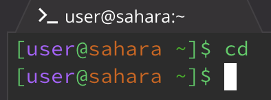

# Minjoo O: CSE15L Lab 1 Report
---
## Using command: *cd*

**Using the command with no arguments:** \
 
* The working directory was: /home
* Because the command cd allows you to change directories, when there is no argument, you simply did not name a directory you wanted to change to. So, the selected directory stays the same. 
  
**Using the command with a path to a directory as an argument:** \
 
* The working directory was: /home 
  
**Using the command with a path to a file as an argument:** \
 
* The working directory was: /home/lecture1
---

## Using command: *ls*
