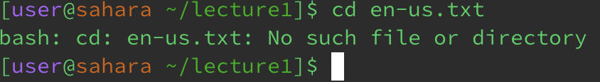

# Minjoo O: CSE15L Lab 1 Report
---
## Using command: *cd*

**Using the command with no arguments:** \
 
* The working directory was: /home
*  
  
**Using the command with a path to a directory as an argument:** \
 
* The working directory was: /home 
  
**Using the command with a path to a file as an argument:** \
 
* The working directory was: /home/lecture1
---

## Using command: *ls*
