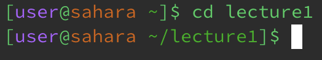
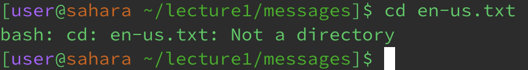

# Minjoo O: CSE15L Lab 1 Report
---
## Using command: `cd`

**Using the command with no arguments:** \
 
* The working directory was: /home/lecture1
* Using the command `cd` with no following argument allows for the user to **change directories** to home directory (or stay in the home directory if they were already there to start with). This is because when there is no argument or directory to switch the terminal into, the terminal goes to its default directory, which is the home
* This output is not an error. Using the command `cd` should take the user to the home directory
  
**Using the command with a path to a directory as an argument:** \
 
* The working directory was: `/home`
* The command `cd` with a path to a directory as an argument allows the user to switch directories. So, because the working directory was `/home`, and the argument or path provided (`/lecture1`) is a directory within the home directory, the output is that we are now in the lecture1 directory (`/home/lecture1`)
* This output is not an error. Using the command `cd` with a valid argument (path to directory) should take the user to the specified directory 
  
**Using the command with a path to a file as an argument:** \

* The working directory was: `/home/lecture1`
* This output is due to the fact that the `cd` command cannot accept a file or anything that is not a directory as an argument. The `cd` command is used to changed from one directory to another directory, not to access files.
* This output is an error. The `cd` command cannot execute because the argument provided is not a path to a directory.
  
---

## Using command: `ls`
